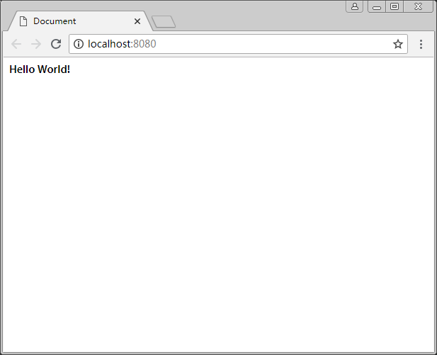
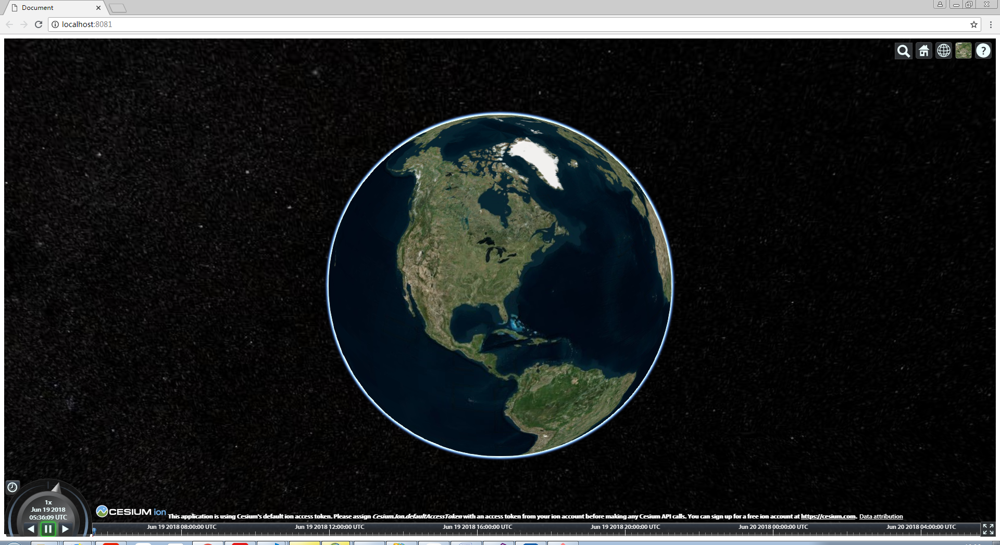

# 使用webpack打包Cesium项目

Webpack是一个好用的javascript代码打包工具，开发者可以使用webpack结构化代码和静态资源，并使用`require`方法加载不同类型的文件。当构建工程时，webpack会查找代码的依赖，并将这些依赖模块打包到一个或者多个包中，供浏览器加载。

## 环境准备
- 对命令行、javascript和web开发有一定了解
- 支持webGL的浏览器
- 安装好的IDE或者文本编辑器。Cesium团队成员使用的是Webstorm，但是其他编辑器像Sublime Text也可以
- Nodejs环境，最好使用LTS版，需版本6以及6以上的Nodejs

## 创建一个webpack应用
我们在创建Cesium应用之前，先介绍如何配置一个webpack项=项目，如果已经有了一个webpack设置，只想把Cesium应用添加到webpack中，可以跳过这一步

### 使用npm初始化应用
创建一个新的文件夹，作为应用的根目录，起名`cesium-webpack-app`。打开命令行工具，将目录切换至该目录，输入以下命令：
```shell
npm init
```
根据提示配置应用的信息，一直按回车键使用默认即可。配置完成后会在目录里多出一个`package.json`文件。

### 编写业务代码
在工程根目录下创建一个`src`文件夹，用于放我们的源文件，也是我们需要编辑的代码的所在处。在打包时，该文件夹内的文件将会打包，然后被输出到`dist`目录中。

创建`src/index.html`文件，添加以下HTML代码：
```html
<!DOCTYPE html>
<html>
  <head>
    <meta charset="utf-8">
    <meta http-equiv="X-UA-Compatible" content="IE=edge">
    <meta name="viewport"
      content="width=device-width, initial-scale=1, maximum-scale=1, minimum-scale=1, user-scalable=no">
    <title>Hello World!</title>
  </head>
  <body>
    <p>Hello World!</p>
  </body>
</html>
```

下面要创建工程的“入口点”，即webpack将从何处来时读取我们的代码和依赖，然后进行打包，然后把打包之后的文件交给`index.html`加载。

先做个示范，直接创建`src/index.js`文件，然后写几行简单的代码，试试能不能工作：
```javascript
// index.js
console.log("Hello World!");
```

### 安装和配置webpack
代码写好之后，就可以安装webpack进行代码打包了。在命令行中输入以下命令：
```shell
npm install -save-dev webpack@3.6.0
```

我们此处用的是3.x版本的webpack，与使用4.x版本的webpack配置过程略有区别。若要使用4.x版本的webpack，可以参考官方文档，但是过程步骤大同小异。

`--save-dev`表明将webpack模块添加到devdependencies部分，即开发环境使用的模块，一般用于辅助开发，并不是生产环境所需的代码，在构建生产环境代码时此部分不会被打包。

#### 配置
在根目录下创建`webpack.config.js`文件，此文件定义我们的webpack配置文件，在进行打包时，会读取这个文件，并根据配置进行打包。
```javascript
// webpack.config.js
const path = require('path');

const webpack = require('webpack');

module.exports = {
	context: __dirname,
	entry: {
		app: './src/index.js'
	},
	output: {
		filename: '[name].js',
		path: path.resolve(__dirname, 'dist'),
	}
};
```

此段代码中，我们先引用了Nodejs的`path`模块以及刚下载的`webpack`模块，在配置里，指定了基础路径`context`为全局的`__dirname`，即根目录。指定入口点`entry`为`src/index.js`，并命名为`app`。这样可以指定webpack打包后的文件名(`app.js`)，然后把这个对象`export`出去，便于后续使用。

#### 加载器
我们需要安装加载器(Loders)来夹在我们的css文件或者其他静态文件。webpack可以将任何格式的文件以模块的方式引用进来，所以我们需要使用加载器来加载这些模块。我们当前应用只需要下载`style-loader`、`css-loader`和`url-loader`
在命令行中输入以下命令：
```shell
npm install --save-dev style-loader css-loader url-loader
```

继续返回`webpack.config.js`，添加模块引入规则(`module.rules`)，此处我们添加两处规则，一个用于引入css文件，另一个用于引入其他的静态文件。对于每个规则，都要定义一个`test`来判断文件的类型，然后使用`use`来定义引入该类型的文件所使用的加载器。
```javascript
const path = require('path');

const webpack = require('webpack');

module.exports = {
    context: __dirname,
    entry: {
        app: './src/index.js'
    },
    output: {
        filename: '[name].js',
        path: path.resolve(__dirname, 'dist'),
    },
    module: {
        rules: [{
            test: /\.css$/,
            use: [ 'style-loader', 'css-loader' ]
        }, {
            test: /\.(png|gif|jpg|jpeg|svg|xml|json)$/,
            use: [ 'url-loader' ]
        }]
    }
};
```

#### 插件
我们创建应用时，需要将`src/index.html`作为模板文件，然后把我们打包好的文件插入进入，所以我们需要安装`html-webpack-plugin`插件
```shell
npm install --save-dev html-webpack-plugin
```
将这个插件加入到`webpack.config.js`中，并添加到`plugins`配置中，将`src/index.html`作为我们的模板文件，webpack就会以此文件作为网页的主体部分，然后再插入打包后的文件。
```javascript
const path = require('path');

const webpack = require('webpack');
const HtmlWebpackPlugin = require('html-webpack-plugin');

module.exports = {
	context: __dirname,
	entry: {
		app: './src/index.js'
	},
	output: {
		filename: '[name].js',
		path: path.resolve(__dirname, 'dist'),
	},
    module: {
        rules: [{
            test: /\.css$/,
            use: [ 'style-loader', 'css-loader' ]
        }, {
            test: /\.(png|gif|jpg|jpeg|svg|xml|json)$/,
            use: [ 'url-loader' ]
        }]
    },
    plugins: [
        new HtmlWebpackPlugin({
            template: 'src/index.html'
        })
    ]
};
```

#### 打包应用
我们在`package.json`中配置一个命令，可以让我们使用Npm来调用。在文件的`scripts`中，已经有了默认的`test`命令，这个可以删掉，不过不删掉也没关系，反正用不到。在此处添加一个`build`命令，用于构建工程。
```json
"scripts": {
  "build": "node_modules/.bin/webpack --config webpack.config.js"
}
```
这个命令就是根据`webpack.config.js`里的配置来进行打包。

然后我们就运行这个脚本吧
```shell
npm run build
```

``` javascript
Hash: 90197109d68682b4e96f
Version: webpack 3.6.0
Time: 352ms
     Asset       Size  Chunks             Chunk Names
    app.js     2.5 kB       0  [emitted]  app
index.html  361 bytes          [emitted]
   [0] ./src/index.js 27 bytes {0} [built]
Child html-webpack-plugin for "index.html":
     1 asset
       [0] ./node_modules/html-webpack-plugin/lib/loader.js!./src/index.html 524 bytes {0} [built]
       [2] (webpack)/buildin/global.js 509 bytes {0} [built]
       [3] (webpack)/buildin/module.js 517 bytes {0} [built]
        + 1 hidden module
```

然后我们会发现在根目录里会自动出现一个`dist`文件夹，里面有`app.js`和`index.html`文件，可以将这个文件放到服务器里发布。

### 运行开发环境服务
我们可以使用`webpack-dev-server`快速构建一个开发环境的服务器环境，可以立即看到我们所构建的应用。

首先，安装依赖：
```shell
npm install --save-dev webpack-dev-server
```

接下来，为我们的`package.json`再添加一个脚本命令，我们使用`start`命令来运行开发环境的服务器，通过`--config`选项来指定配置文件，使用`--open`选项来指定这个命令运行时，在浏览器中打开引用。
```json
"scripts": {
  "build": "node_modules/.bin/webpack --config webpack.config.js",
  "start": "node_modules/.bin/webpack-dev-server --config webpack.config.js --open"
}
```
我们还要指定一个开发服务端的目录，当然使我们所构建生成的`dist`目录。在`webpack.config.js`中添加如下代码：
```javascript
devServer: {
  contentBase: path.join(__dirname, "dist")
}
```

然后就可以运行这个应用了：
```shell
npm start
```
运行之后，浏览器会直接打开，并自动跳转到`localhost:8080`页面，你就会看到如下的界面：



## 构建Cesium应用
我们将Cesium应用使用webpack来进行构建和运行。

### 安装Cesium
首先使用Npm安装cesium
```shell
npm install --save-dev cesium
```

### 配置webpack
Cesium结构比较复杂，不仅有javascript模块，还有很多静态文件，像css、图片，以及json文件。还包括了web workers文件，让计算部分集中在其他的线程。和其他一般npm模块不同的是，Cesium没有定义入口点，因为不同的库使用的方法不同，所以需要一些额外的配置让Cesium顺利运行。

首先，定义Cesium的文件路径。我们要使用源码文件来打包，这样webpack才能找到每个模块所有的依赖项。或者使用已经打包好的Cesium库，但是这种方法容易产生一些问题，而且失去了webpack打包的灵活性。

修改`webpack.config.js`，添加源文件和web workers文件路径
```javascript
// The path to the Cesium source code
const cesiumSource = 'node_modules/cesium/Source'
const cesiumWorkers = '../Build/Cesium/Workers'
```
然后，在webpack配置模块中添加以下内容，解决一些webpack编译cesium过程中产生的一些错误：
```javascript
output: {
    filename: '[name].js',
    path: path.resolve(__dirname, 'dist'),

    // 用于编译多行字符串
    sourcePrefix: ''
},
amd: {
    toUrlUndefined: true
},
node: {
    fs: 'empty'
},
```

我们看一下需要这么配置的原因：
- `output.sourcePrefix: ''` 一些版本的webpack默认在输出时，会在每一行的前面加一个`\t`，即`tab`键，cesium有很多定义的多行字符串，使用`tab`很可能会出错误，所以指定这个前缀为一个空字符串
- `amd.toUrlUndefined: true` 这个配置让webpack使用AMD的`require`打包时，不用去找`toUrl`方法
- `node.fs` 解决`fs`模块加载第三方库的问题，表明是在Node环境中执行，而不是在浏览器中执行

之后，为cesium库添加一个别名，这样就可以像node模块一样加载了
```javascript
resolve: {
  alias: {
    cesium: path.resolve(__dirname, cesiumSource)
  }
}
```

### 管理静态文件

下面，要处理Cesium的静态文件，包括窗体、web workers文件，确保其加载正确。

使用`copy-webpack-plgin`插件，可以在构建过程中的部分文件拷贝到`dist`文件夹中。

首先，安装插件
```shell
npm install --save-dev copy-webpack-plugin
```

将插件引入到`webpack.config.js`中
```javascript
const CopywebpackPlugin = require("copy-webpack-plugin")
```

拷贝静态文件
```javascript
plugins: [
  new HtmlWebpackPlugin({
      template: 'src/index.html'
    }),
  // Copy Cesium Assets, Widgets, and Workers to a static directory
  new CopywebpackPlugin([ { from: path.join(cesiumSource, cesiumWorkers), to: 'Workers' } ]),
  new CopywebpackPlugin([ { from: path.join(cesiumSource, 'Assets'), to: 'Assets' } ]),
  new CopywebpackPlugin([ { from: path.join(cesiumSource, 'Widgets'), to: 'Widgets' } ])
],
```

最后，定义一个环境变量，设置Cesium的地址
```javascript
plugins: [
    new HtmlWebpackPlugin({
        template: 'src/index.html'
    }),
    // Copy Cesium Assets, Widgets, and Workers to a static directory
    new CopywebpackPlugin([ { from: path.join(cesiumSource, cesiumWorkers), to: 'Workers' } ]),
    new CopywebpackPlugin([ { from: path.join(cesiumSource, 'Assets'), to: 'Assets' } ]),
    new CopywebpackPlugin([ { from: path.join(cesiumSource, 'Widgets'), to: 'Widgets' } ]),
    new webpack.DefinePlugin({
        // Define relative base path in cesium for loading assets
        CESIUM_BASE_URL: JSON.stringify('')
    })
],
```

### 将Cesium模块加入到应用中
有几种方法可以吧Cesium作为一个独立的模块加入到应用中，可以使用CommonJS的方法，也可以使用ES6的模块化方法`import`引入。你可以引入整个Cesium，也可以只引用其中的某一个模块。

#### CommonJS方法
引入整个Cesium库：
```javascript
var Cesium = require('cesium/Cesium')
var viewer = new Cesium.Viewer('cesiumContainer')
```

引入单个模块：
```javascript
var Color = require('cesium/Core/Color')
var color = Color.fromRandom()
```

#### ES6方法
引入整个Cesium模块
```javascript
import Cesium from 'cesium/Cesium'
var viewer = new Cesium.Viewer('cesiumContainer')
```

引入单个模块
```javascript
import Color from 'cesium/core/Color'
var color = Color.fromRandom()
```

### 引入静态文件
直接使用`require`方法引入静态文件
```javascript
require('cesium/Widgets/widgets.css')
```

## Hello World程序
现在环境已经配置好了，可以征程的加载Cesium了，我们可以创建Cesium应用了

首先修改`src/index.js`文件，删去原有内容，引入Cesium
```javascript
var Cesium = require('cesium/Cesium')
```
然后加入窗体样式的css文件
```javascript
require('cesium/Widgets/widgets.css')
```

在`src/index.html`中，我们加入一个`div`，用于承载我们的cesium窗口
```html
<div id="cesiumContainer"></div>
```
最后，在`src/index.js`中，初始化Cesium的Viewer类
```javascript
var viewer = new Cesium.Viewer('cesiumContainer')
```

返回命令行，使用`npm start`命令，会看到浏览器中加载出来了地球


地球虽然加载出来了，但是发现四周有一道白边，不好看，下面写css把这个白边去掉。

在`src`中新建一个文件夹`css`用于放css文件，新建`src/css/main.css`文件，写入样式
```css
html, body, #cesiumContainer {
	width: 100%;
	height: 100%;
	margin: 0;
	padding: 0;
	overflow: hidden;
}
```
然后把css引入，在`src/index.js`里还用`require`方式引入
```javascript
require('./css/main.css')
```

重启服务器，就会发现白边不见了(在终端中按`ctrl`+'C'键可以停止服务，再打开时再次输入`npm start`即可)

## webpack高级配置
webpack还有其他功能，可以提高性能、缩小打包文件的体积，下面使用几种方法优化一下该项目。

### 代码分离
webpack会默认吧Cesium里所有东西都打包在一起，这样就会导致引入的包特别大，网络不加的情况下会下载的很慢。我们将Cesium的各个部分分开，可以加快加载速度。

我们使用`CommonChunksPlugin`插件来完成这一功能，在`webpack.config.js`中加入以下代码：
```javascript
plugins: [
    new webpack.optimize.CommonsChunkPlugin({
        name: 'cesium',
        minChunks: module => module.context && module.context.indexOf('cesium') !== -1
    })
]
```

### 添加sourcemap
sourcemap可以帮助开发过程中定位错误位置，我们只需要将`devtool`的值设置为`eval`即可
```javascript
devtool: "eval"
```
生产环境没必要生成sourcemap

### 删除错误提示
在生产环境中没有必要保留错误提示，一般情况下在压缩代码时会把这些错误提示删除掉，而webpack没有内置方法删除这些警告和错误，我们将使用`strip-pragma-loader`来处理
```shell
npm install --save-dev strip-pragma-loader
```
在`webpack.config.js`中，将`module.rules`中的`debug`设置为`false`
```javascript
rules: [{
    // Strip cesium pragmas
    test: /\.js$/,
      enforce: 'pre',
      include: path.resolve(__dirname, cesiumSource),
      use: [{
        loader: 'strip-pragma-loader',
        options: {
            pragmas: {
            debug: false
          }
        }
      }]
}]
```

### 代码压缩和混淆
生产环境的代码都是经过压缩和混淆过的，我们使用`uglifyjs-webpack-plugin`来进行混淆代码。
```shell
npm install uglifyjs-webpack-plugin --save-dev
```

然后引入

```javascript
const UglifyJsPlugin = require('uglifyjs-webpack-plugin');
```

加入到插件列表中：
```javascript
plugins: [
    new webpack.optimize.UglifyJsPlugin()
]
```

要将css文件枷锁，可以把`css-loader`的`minimize`属性设置为`true`
```javascript
module: {
    rules: [{
        test: /\.css$/,
        use: [
            'style-loader',
            {
                loader: 'css-loader',
                options: {
                    // minify loaded css
                    minimize: true
                }
            }
        ]
    }]
}
```


